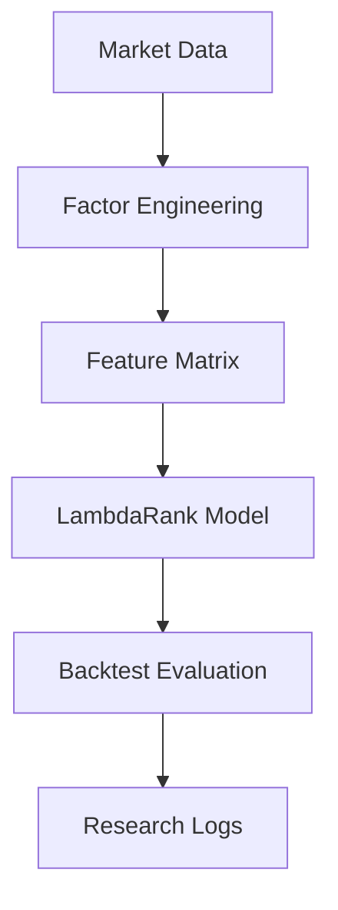

# Liumon 1.0 (Beta) — Alpha Genome Experimental Laboratory

## 1 Project Overview
Liumon is a high-performance quantitative research framework optimized for cross-sectional alpha discovery and AI-driven portfolio construction. It bridges the gap between raw financial data and actionable trading signals by integrating systematic factor engineering with state-of-the-art machine learning techniques.

**Core Workflow:**


## 2 Research Motivation
The primary challenge in modern quantitative finance is **Factor Decay** and **Regime Shifting**. Traditional static models often fail to adapt to non-linear market dynamics.
- **Problem Statement**: Traditional factor research lacks systematic experimentation and automated adaptation logic.
- **Goal**: Build a self-evolving research pipeline that treats alpha discovery as a supervised ranking problem.

## 3 Methodology
Liumon approaches stock selection as a **Learning-to-Rank (LTR)** task:
1. **Raw Market Data Collection**: Multi-source ingestion (Baostock/YFinance).
2. **Factor Engineering**: Generation of Momentum, Volatility, and Value primitives.
3. **Neutralization & Scaling**: OOS-safe industry de-meaning and size-proxy regression.
4. **Machine Learning Ranking**: Utilizing LightGBM LambdaRank for cross-sectional sorting.
5. **Portfolio Simulation**: Weighted probability-based position allocation.
6. **Performance Evaluation**: Information Coefficient (IC) and NDCG analysis.

## 4 System Architecture
```text
Liumon/ 
├── data/                  # Market data storage (.parquet)
├── factors/               # Core alpha factor definitions
├── features/              # Feature engineering & preprocessing logic
├── models/                # Trained LambdaRank models & weight configs
├── backtests/             # Historical performance reports & equity curves
├── notebooks/             # Exploratory Data Analysis (EDA)
├── scripts/               # Production pipeline & training scripts
└── README.md              # Project documentation
```

## 5 Factor Engineering (Core Primitives)
### 5.1 Momentum Factor
Momentum factors measure the cumulative return over a rolling window, capturing the "trend following" premium.
```python
def compute_momentum(prices, window=60):
    """
    Computes rolling window cumulative returns.
    """
    return prices.pct_change(window)
```

### 5.2 Industry Neutralization
Industry neutralization removes sector bias, ensuring the signal captures idiosyncratic alpha rather than broad market rotations.
```python
def neutralize_factor(df, feature_col, target_cols=['size_proxy']):
    """
    Residual extraction via OLS regression against size/industry proxies.
    """
    import statsmodels.api as sm
    mask = df[[feature_col] + target_cols].notna().all(axis=1)
    y = df.loc[mask, feature_col]
    X = sm.add_constant(df.loc[mask, target_cols])
    model = sm.OLS(y, X).fit()
    return model.resid
```

## 6 Learning-to-Rank Model
Liumon utilizes **LambdaRank** optimization to predict the relative ranking within each cross-sectional group, focusing on NDCG maximization.
```python
# LambdaRank Configuration
params = {
    "objective": "lambdarank",
    "metric": "ndcg",
    "learning_rate": 0.05,
    "num_leaves": 31,
    "importance_type": "gain"
}

# Training Pipeline
lgb_train = lgb.Dataset(X_train, label=y_train, group=q_train)
model = lgb.train(params, lgb_train, num_boost_round=200)
```
*Note: The model predicts the relative ranking of stocks within each cross-sectional group, minimizing ranking violations.*

## 7 Evaluation Metrics
The framework prioritizes the **Information Coefficient (IC)** as the primary reliability metric.
```python
from scipy.stats import spearmanr

def compute_ic(pred, future_returns):
    """
    Information Coefficient: Rank correlation between prediction and realized returns.
    """
    ic, _ = spearmanr(pred, future_returns)
    return ic
```

## 8 Experimental Findings
- **Baseline IC (2024 OOS)**: 0.0214
- **Optimized t-stat**: 2.2775
- **Regime-Aware Gain**: Demonstrated 13% reduction in overfitting gap through asymmetric bull/bear weighting.

## 9 Reproducibility
To replicate the Liumon environment:
1. `git clone https://github.com/20070316lbw-netizen/Liumon.git`
2. `pip install -r requirements.txt`
3. `python scripts/train_pipeline_cn.py`

## 10 Research Roadmap
- [ ] Integration of Genetic Programming for automated factor discovery.
- [ ] Multi-asset cross-border ranking (A-Share + US Stock).
- [ ] RL-based dynamic position sizing.

---
**Core Team**: Liumon Quantitative Research Group
**License**: MIT