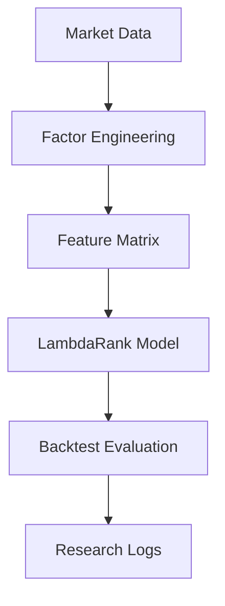
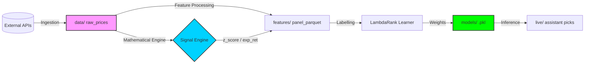

# Liumon 1.0 (Beta) — Alpha Genome Experimental Laboratory

[English](README.MD) | [中文](README_zh.md)

## 1 Project Overview
Liumon is a high-performance quantitative research framework optimized for cross-sectional alpha discovery and AI-driven portfolio construction. It bridges the gap between raw financial data and actionable trading signals by integrating systematic factor engineering with state-of-the-art machine learning techniques.

**Core Workflow:**



## 2 Research Motivation
The primary challenge in modern quantitative finance is **Factor Decay** and **Regime Shifting**. Traditional static models often fail to adapt to non-linear market dynamics.
- **Problem Statement**: Traditional factor research lacks systematic experimentation and automated adaptation logic.
- **Goal**: Build a self-evolving research pipeline that treats alpha discovery as a supervised ranking problem.

## 3 Methodology (Alpha Genome v3.0)
Liumon approaches stock selection as a **Learning-to-Rank (LTR)** task with strict out-of-sample (OOS) validation:
1. **OOS Validation**: Utilizing **2024 Full Year** as a completely independent test set to prevent data leakage.
2. **Dual Metric Evaluation**: Optimizing for **Information Coefficient (IC)** and **NDCG@10**.
3. **Overfitting Monitoring**: Real-time tracking of the "Gap" between IS (In-Sample) and OOS performance.
4. **Market Regime Sensing**: Dynamic tag injection (Bull/Bear) based on macro indices.

---

## 4 Core Strategy Design

### 4.1 Alpha Factor Library
Liumon integrates a curated set of genome factors:
- ✅ **Momentum**: `mom_20d`, `mom_60d`, `mom_120d`, `mom_12m_minus_1m` (12-1 Momentum).
- ✅ **Volatility**: `vol_60d` + Orthogonalized residual `vol_60d_res` (Mom-adjusted).
- ✅ **Value**: `S/P ratio` (Sales-to-Price) for robust valuation.
- ✅ **Liquidity**: `turn_20d` (Average 20-day turnover).

### 4.2 Multi-Horizon Labeling
The framework generates labels for multiple time horizons to capture different alpha decay profiles:
- 📌 **Short-term**: `5d`
- 📌 **Medium-term**: `20d` (Primary Objective)
- 📌 **Long-term**: `60d`, `120d`

### 4.3 Preprocessing Pipeline
Strict engineering pipeline to ensure signal reliability:
- ✅ **MAD Winsorization**: Median Absolute Deviation for outlier handling.
- ✅ **Size Neutralization**: OLS residual extraction against market-cap proxies.
- ✅ **Industry Neutralization**: Cross-sectional de-meaning within sectors.
- ✅ **Factor Orthogonalization**: `Vol ~ Mom` regression to extract pure volatility alpha.

---

## 5 System Architecture
```text
Liumon/ 
├── data/                  # Market data storage (.parquet)
├── factors/               # Core alpha factor definitions
├── features/              # Feature engineering & preprocessing logic
├── liumon/                # Core Package (Engine, Backtest, Data)
├── models/                # Trained LambdaRank models & weight configs
├── backtests/             # Historical performance reports & equity curves
├── research_db/           # Experimental findings & research logs
├── tests/                 # Reliability testing suite
├── scripts/               # Simplified entry points (train, backtest, live)
└── README.MD              # Project documentation
```

## 6 Data Flow (Pipeline Architecture)

Liumon follows a strictly decoupled data ingestion and processing pipeline:



1.  **Ingestion**: `liumon.data` fetches A-share OHLCV and macro regimes into local Parquet files.
2.  **Signal Engine ⭐⭐⭐⭐**: Acts as a mathematical high-order feature generator.
    - **Logic**: Fixed 84-day sequence window for cross-ticker consistency.
    - **Metric**: `Regime Strength = mean_return / max(std, noise_floor)`.
    - **Safety**: Noise floor protection prevents extreme leverage in low-volatility regimes.
3.  **Transformation**: `preprocess_cn.py` integrates Signal Engine outputs with genomic factors.
4.  **Optimization**: `train.py` consumes daily panels to optimize ranking weights via LightGBM.
5.  **Action**: `live.py` executes the full cycle to output actionable signals.

---

## 7 Backtest Engineering ⭐⭐⭐⭐⭐

Dedicated backtesting engine located in `liumon/backtest/`:
- **High Concurrency**: Utilizes `ProcessPoolExecutor` with safe worker throttling (`min(8, cores/2)`).
- **Rich Recording**: Automatically captures future returns (1d/5d), realized volatility, and intra-period range.
- **Visual Feedback**: Real-time progress bars via `tqdm` and clear summary tables.
- **Data Integrity**: Automatic merging and cleanup of temporary worker files.

---

## 8 Risk Management & Deployment

### 8.1 Risk Control Module
Built-in protection in `liumon/core/risk_mgmt.py`:
- **Volatility Targeting**: Dynamic position scaling based on realized risk.
- **Drawdown Breaker**: Hard stop-loss logic when max drawdown thresholds are breached.

### 8.2 Live Deployment & API Integration
Example of connecting Liumon picks to a brokerage API:
```python
from liumon.core.signal_engine import SignalEngine
from liumon.core.risk_mgmt import RiskManager

# 1. Generate Signal
picks = engine.get_top_picks(n=3)

# 2. Risk Check
position_scale = risk_manager.calculate_position_scale(current_vol=0.18)

# 3. Execution (Conceptual)
for stock in picks:
    broker.place_order(ticker=stock.id, amount=10000 * position_scale)
```

### 8.3 Reliability Testing
Each core module is covered by a test suite ensuring mathematical correctness:
```bash
pytest tests/
```

---

## 9 Learning-to-Rank Model
Liumon utilizes **LambdaRank** optimization to predict the relative ranking within each cross-sectional group, focusing on NDCG maximization.
```python
# LambdaRank Configuration
params = {
    "objective": "lambdarank",
    "metric": "ndcg",
    "learning_rate": 0.05,
    "num_leaves": 31,
    "importance_type": "gain"
}
```

## 10 Experimental Findings
- **Baseline OOS IC**: 0.0214
- **Optimized t-stat**: 2.2775
- **Overfitting Gap Monitor**: Detailed logs available in `liumon/research_db/`.

## 11 Reproducibility
To replicate the Liumon environment:
1. `git clone https://github.com/20070316lbw-netizen/Liumon.git`
2. `pip install -r requirements.txt`
3. `python scripts/live.py` (For full production pipeline)

---
**Core Team**: Liumon Quantitative Research Group
**License**: MIT