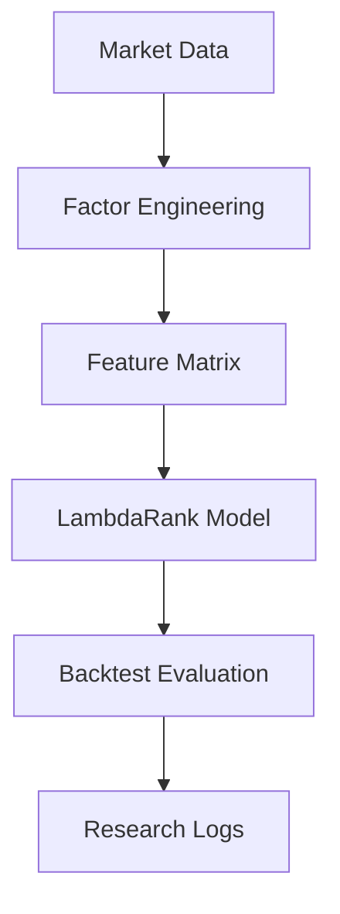
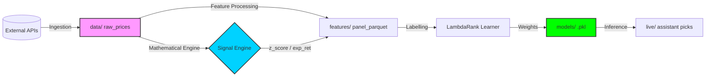

[English](README.md) | [中文](README_zh.md)

# Liumon 1.0 (Beta) — Alpha Genome Experimental Laboratory

## 1 Project Overview
Liumon is a high-performance quantitative research framework optimized for cross-sectional alpha discovery and AI-driven portfolio construction. It bridges the gap between raw financial data and actionable trading signals by integrating systematic factor engineering with state-of-the-art machine learning techniques.

**Core Workflow:**



## 2 Research Motivation
The primary challenge in modern quantitative finance is **Factor Decay** and **Regime Shifting**. Traditional static models often fail to adapt to non-linear market dynamics.
- **Problem Statement**: Traditional factor research lacks systematic experimentation and automated adaptation logic.
- **Goal**: Build a self-evolving research pipeline that treats alpha discovery as a supervised ranking problem.

## 3 Methodology (Alpha Genome v3.0)
Liumon approaches stock selection as a **Learning-to-Rank (LTR)** task with strict out-of-sample (OOS) validation:
1. **OOS Validation**: Utilizing **2024 Full Year** as a completely independent test set to prevent data leakage.
2. **Dual Metric Evaluation**: Optimizing for **Information Coefficient (IC)** and **NDCG@10**.
3. **Overfitting Monitoring**: Real-time tracking of the "Gap" between IS (In-Sample) and OOS performance.
4. **Market Regime Sensing**: Dynamic tag injection (Bull/Bear) based on macro indices.

---

## 4 Core Strategy Design

### 4.1 Alpha Factor Library
Liumon integrates a curated set of genome factors:
- ✅ **Momentum**: `mom_20d`, `mom_60d`, `mom_120d`, `mom_12m_minus_1m` (12-1 Momentum).
- ✅ **Volatility**: `vol_60d` + Orthogonalized residual `vol_60d_res` (Mom-adjusted).
- ✅ **Value**: `S/P ratio` (Sales-to-Price) for robust valuation.
- ✅ **Liquidity**: `turn_20d` (Average 20-day turnover).

**Implementation Highlight (Momentum):**
```python
def compute_momentum(prices, window=60):
    """
    Captured in preprocessing:
    df["mom_20d"] = df["close"].pct_change(20)
    df["mom_12m_minus_1m"] = df["close"].shift(22) / df["close"].shift(252) - 1
    """
    return prices.pct_change(window)
```

### 4.2 Multi-Horizon Labeling
The framework generates labels for multiple time horizons to capture different alpha decay profiles:
- 📌 **Short-term**: `5d`
- 📌 **Medium-term**: `20d` (Primary Objective)
- 📌 **Long-term**: `60d`, `120d`

### 4.3 Preprocessing Pipeline
Strict engineering pipeline to ensure signal reliability. The `features/preprocess_cn.py` pipeline applies the following steps:
- ✅ **MAD Winsorization**: Median Absolute Deviation for outlier handling. We winsorize extreme values to maintain statistical integrity.
- ✅ **Size Neutralization**: OLS residual extraction against market-cap proxies. Factors are neutralized against `size_proxy` (computed as log of price * volume).
- ✅ **Industry Neutralization**: Cross-sectional de-meaning within sectors. After normalization, factors are grouped by `industry_name` and converted to percentile ranks.
- ✅ **Factor Orthogonalization**: `Vol ~ Mom` regression to extract pure volatility alpha. We strip the momentum effect from volatility.
- ✅ **Rank Labelling**: For the LambdaRank model, next month's returns are converted into categorical rank labels (0-4) by quintile bucketing.

**Implementation Highlight (Neutralization):**
```python
def neutralize_factor(df, feature_col, target_cols=['size_proxy']):
    """
    Residual extraction via OLS regression against size proxies.
    """
    import statsmodels.api as sm
    mask = df[[feature_col] + target_cols].notna().all(axis=1)
    y = df.loc[mask, feature_col]
    X = sm.add_constant(df.loc[mask, target_cols])
    model = sm.OLS(y, X).fit()
    return model.resid
```

---

## 5 System Architecture
```text
Liumon/ 
├── data/                  # Market data storage (.parquet)
├── factors/               # Core alpha factor definitions
├── features/              # Feature engineering & preprocessing logic
├── liumon/                # Core Package (Engine, Backtest, Data)
├── models/                # Trained LambdaRank models & weight configs
├── backtests/             # Historical performance reports & equity curves
├── research_db/           # Experimental findings & research logs
├── tests/                 # Reliability testing suite
├── scripts/               # Simplified entry points (train, backtest, live)
└── README.MD              # Project documentation
```

## 6 Data Flow (Pipeline Architecture)

Liumon follows a strictly decoupled data ingestion and processing pipeline:



1.  **Ingestion**: `liumon.data` fetches A-share OHLCV and macro regimes into local Parquet files.
2.  **Signal Engine**: Acts as a mathematical high-order feature generator.
    - **Logic**: Fixed 84-day sequence window for cross-ticker consistency.
    - **Metric**: `Regime Strength = mean_return / max(std, noise_floor)`.
    - **Safety**: Noise floor protection prevents extreme leverage in low-volatility regimes.
3.  **Transformation**: `preprocess_cn.py` integrates Signal Engine outputs with genomic factors.
4.  **Optimization**: `train.py` consumes daily panels to optimize ranking weights via LightGBM.
5.  **Action**: `live.py` executes the full cycle to output actionable signals.

---

## 7 Backtest Engineering

Dedicated backtesting engine located in `liumon/backtest/`:
- **High Concurrency**: Utilizes `ProcessPoolExecutor` with safe worker throttling (`min(8, cores/2)`).
- **Rich Recording**: Automatically captures future returns (1d/5d), realized volatility, and intra-period range.
- **Visual Feedback**: Real-time progress bars via `tqdm` and clear summary tables.
- **Data Integrity**: Automatic merging and cleanup of temporary worker files.

---

## 8 Risk Management & Deployment

### 8.1 Risk Control Module
Built-in protection in `liumon/core/risk_mgmt.py`:
- **Volatility Targeting**: Dynamic position scaling based on realized risk.
- **Drawdown Breaker**: Hard stop-loss logic when max drawdown thresholds are breached.

### 8.2 Live Deployment & API Integration
Example of connecting Liumon picks to a brokerage API:
```python
from liumon.core.signal_engine import SignalEngine
from liumon.core.risk_mgmt import RiskManager

# 1. Generate Signal
picks = engine.get_top_picks(n=3)

# 2. Risk Check
position_scale = risk_manager.calculate_position_scale(current_vol=0.18)

# 3. Execution (Conceptual)
for stock in picks:
    broker.place_order(ticker=stock.id, amount=10000 * position_scale)
```

### 8.3 Reliability & Testing Framework
Each core module is covered by a test suite ensuring mathematical correctness and edge-case resilience.

**1. How to Run:**
```bash
# Execute all tests
pytest tests/

# With coverage report
pytest --cov=liumon tests/
```

**2. Test Coverage & Purpose:**
- **`test_risk_mgmt.py`**: Validates the **Target Volatility Scaling** logic. It ensures that positions are accurately reduced in high-volatility regimes and that the **Drawdown Breaker** triggers at exactly 20%.
- **`test_signal_engine.py`**: Verifies the **Noise Floor Protection** and fixed-sequence padding. It ensures the signal generation remains numerically stable even with extreme outliers or missing data.

**3. Underlying Principles:**
- **Numerical Defense**: Automated checks to prevent division-by-zero or NaN propagation in the signal engine.
- **Fail-Safe Verification**: Ensuring the risk module defaults to conservative (zero-position) states when market data is corrupted.
- **Contract Testing**: Ensuring that the internal `math_predictor` API returns consistent tensors matched to the LightGBM input shape.

---

## 9 Learning-to-Rank Model
Liumon utilizes **LambdaRank** optimization to predict the relative ranking within each cross-sectional group, focusing on NDCG maximization.

**Algorithm Configuration:**
```python
# LambdaRank Configuration
params = {
    "objective": "lambdarank",
    "metric": "ndcg",
    "learning_rate": 0.05,
    "num_leaves": 31,
    "importance_type": "gain"
}

# Training Pipeline
lgb_train = lgb.Dataset(X_train, label=y_train, group=q_train)
model = lgb.train(params, lgb_train, num_boost_round=200)
```
*Note: The model predicts the relative ranking of stocks within each cross-sectional group, minimizing ranking violations.*

---

## 10 Evaluation Metrics
The framework prioritizes the **Information Coefficient (IC)** as the primary reliability metric.

```python
from scipy.stats import spearmanr

def compute_ic(pred, future_returns):
    """
    Information Coefficient: Rank correlation between prediction and realized returns.
    """
    ic, _ = spearmanr(pred, future_returns)
    return ic
```

---

## 11 Experimental Findings
- **Baseline OOS IC**: 0.0214
- **Optimized t-stat**: 2.2775
- **Overfitting Gap Monitor**: Detailed logs available in `liumon/research_db/`.

## 12 Reproducibility (Quick Start Guide)
To replicate the Liumon environment and run the full pipeline:
1. **Clone the repository:**
   ```bash
   git clone https://github.com/20070316lbw-netizen/Liumon.git
   cd Liumon
   ```
2. **Install dependencies:**
   ```bash
   pip install -r requirements.txt
   ```
3. **Run the full production pipeline:**
   This script automates data ingestion, macro feature fetching, feature engineering, and model training.
   ```bash
   python scripts/live.py
   ```
   **Alternative step-by-step execution:**
   - **Data Fetching:** Fetch A-share OHLCV data and macroeconomic regimes.
     ```bash
     python liumon/data/data_fetch_cn.py
     python liumon/data/data_fetch_macro.py
     ```
   - **Feature Preprocessing:** Generate features, perform neutralization, and save the feature matrix.
     ```bash
     python features/preprocess_cn.py
     ```
   - **Model Training:** Train the LambdaRank model.
     ```bash
     python scripts/train.py
     ```
   - **Backtesting (Optional):** Run a simulation using historical data.
     ```bash
     python scripts/backtest.py
     ```

---

## ⚠️ Disclaimer / 免责声明
The code and data in this project are for educational and research purposes only and do not constitute any investment advice. Please use with caution.
本项目的代码和数据仅供学习和研究使用，不构成任何投资建议，请谨慎使用。

---

## 👨‍💻 Team & Contact

**Project Lead:** **Bowei Liu**
- **Email**: [20070316lbw@gmail.com]
- **University**: Hunan University of Information Technology (大一 / Freshman)
- **Major**: Financial Management (财务管理)

**Core Contributors:**
- **Bowei Liu**: Architecture design, manual manual authorship, and result evaluation. (提供了一双手和一个脑子)
- **Gemini**: Coding MASTER, responsible for script writing, model building, and debugging. (代码编写高手)
- **Claude**: Project report auditor and conversational collaborator; raised many critical questions during research. (项目报告检查兼聊天员)
- **ChatGPT**: Project report auditor and advisor; contributed key insights to methodology. (项目报告检查)
- **GLM**: Integrated via API for news labeling; a great teacher for NLP tasks.Will have a new position in the future. (API 接入，新闻打标签,未来将会有其他更重要任务)

*(Names listed in no particular order; all are core forces of the project.)*

---
**License**: MIT