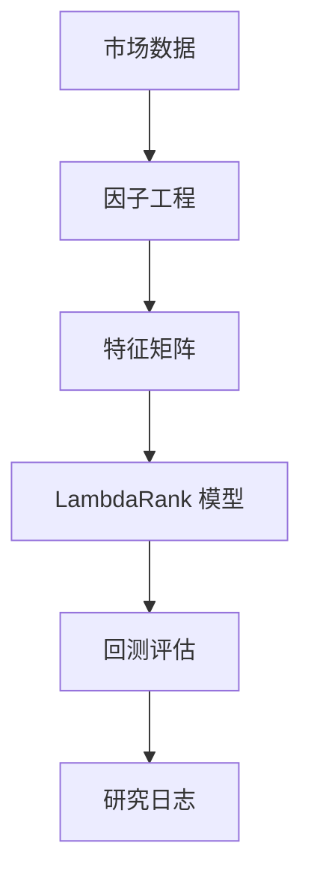
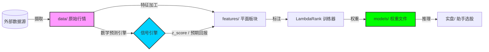

# Liumon 1.0 (Beta) — Alpha Genome 实验实验室

[English](README.MD) | [中文](README_zh.md)

## 1 项目概述
Liumon 是一个高性能量化研究框架，专为横截面 Alpha 发现和 AI 驱动的投资组合构建而优化。它通过将系统化的因子工程与尖端机器学习技术相结合，弥合了原始金融数据与可执行交易信号之间的鸿沟。

**核心工作流：**



## 2 研究动机
现代量化金融的主要挑战是 **因子衰减 (Factor Decay)** 和 **市场状态切换 (Regime Shifting)**。传统的静态模型往往难以适应非线性市场动态。
- **问题陈述**：传统因子研究缺乏系统性的实验和自动化的适配逻辑。
- **目标**：构建一个自我进化的研究流水线，将 Alpha 发现视为受监督的排序问题。

## 3 研究方法 (Alpha Genome v3.0)
Liumon 将股票选择视为一个 **排序学习 (Learning-to-Rank, LTR)** 任务，并采用严格的样本外 (OOS) 验证：
1. **样本外验证 (OOS)**：使用 **2024 年全年度** 作为完全独立的测试集，以防止数据泄露。
2. **双指标评估**：同时优化 **信息系数 (IC)** 和 **NDCG@10**。
3. **过拟合监控**：实时追踪样本内 (IS) 与样本外 (OOS) 表现之间的“差距 (Gap)”。
4. **市场状态感应**：基于宏观指数动态注入状态标签（牛市/熊市）。

---

## 4 核心策略设计

### 4.1 Alpha 因子库
Liumon 整合了一套精心筛选的基因因子：
- ✅ **动量因子 (Momentum)**：`mom_20d`, `mom_60d`, `mom_120d`, `mom_12m_minus_1m` (12-1 动量)。
- ✅ **波动率因子 (Volatility)**：`vol_60d` + 正交化残差 `vol_60d_res` (剥离动量影响)。
- ✅ **价值因子 (Value)**：`S/P ratio` (销售额价格比)，提供稳健的估值锚点。
- ✅ **流动性因子 (Liquidity)**：`turn_20d` (20日平均换手率)。

**代码实现亮点 (动量因子):**
```python
def compute_momentum(prices, window=60):
    """
    在预处理中捕捉：
    df["mom_20d"] = df["close"].pct_change(20)
    df["mom_12m_minus_1m"] = df["close"].shift(22) / df["close"].shift(252) - 1
    """
    return prices.pct_change(window)
```

### 4.2 多周期标签体系
框架生成多个时间周期的标签，以捕捉不同的 Alpha 衰减特征：
- 📌 **短期**：`5d`
- 📌 **中期**：`20d` (核心预测目标)
- 📌 **长期**：`60d`, `120d`

### 4.3 预处理流水线
严格的工程管线确保信号的可靠性：
- ✅ **MAD 去极值**：中位数绝对偏差处理异常值。
- ✅ **市值中性化**：通过对市值代理变量的 OLS 回归提取残差。
- ✅ **行业中性化**：行业内的横截面去均值处理。
- ✅ **因子正交化**：执行 `Vol ~ Mom` 回归以提取纯净的波动率 Alpha。

**代码实现亮点 (中性化):**
```python
def neutralize_factor(df, feature_col, target_cols=['size_proxy']):
    """
    通过对市值代理变量的 OLS 回归提取残差。
    """
    import statsmodels.api as sm
    mask = df[[feature_col] + target_cols].notna().all(axis=1)
    y = df.loc[mask, feature_col]
    X = sm.add_constant(df.loc[mask, target_cols])
    model = sm.OLS(y, X).fit()
    return model.resid
```

---

## 5 系统架构
```text
Liumon/ 
├── data/                  # 市场数据存储 (.parquet)
├── factors/               # 核心 Alpha 因子定义
├── features/              # 特征工程与预处理逻辑
├── liumon/                # 核心包 (引擎、回测、数据)
├── models/                # 已训练的 LambdaRank 模型与权重配置
├── backtests/             # 历史表现报告与权益曲线
├── liumon/research_db/    # 实验发现与研究日志
├── tests/                 # 可靠性测试套件
├── scripts/               # 简化入口脚本 (训练、回测、实盘)
└── README.MD              # 项目文档
```

## 6 数据流向 (流水线架构)

Liumon 遵循严格解耦的数据摄取与处理流程：



1.  **数据摄取 (Ingestion)**: `liumon.data` 负责将 A 股 OHLCV 和宏观状态抓取至本地 Parquet 文件。
2.  **信号引擎**: 作为数学高阶特征生成器。
    - **逻辑**: 固定 84 天序列窗口，解决不同个股交易日不一致问题。
    - **指标**: `Regime Strength = mean_return / max(std, noise_floor)`。
    - **安全**: 噪声地板保护，防止在低波动环境下产生极端杠杆。
3.  **特征转化 (Transformation)**: `preprocess_cn.py` 将信号引擎信号与基因因子整合。
4.  **模型优化 (Optimization)**: `train.py` 消耗每日数据面板，通过 LightGBM 优化横截面排序权重。
5.  **信号执行 (Action)**: `live.py` 驱动完整流水线，输出可执行信号。

---

## 7 回测工程

位于 `liumon/backtest/` 的专业回测引擎：
- **高并发支持**: 使用 `ProcessPoolExecutor`，配合安全线程控制 (`min(8, cores/2)`)。
- **详尽记录**: 自动捕捉未来收益 (1d/5d)、已实现波动率及区间振幅。
- **进度可视化**: 通过 `tqdm` 提供实时进度条与清晰的汇总表。
- **数据完整性**: 自动合并与清理 worker 碎片文件。

---

## 8 风险管理与实盘部署

### 8.1 风险控制模块
内置于 `liumon/core/risk_mgmt.py` 的保护机制：
- **波动率目标 (Vol Targeting)**: 基于已实现风险的动态仓位缩放。
- **最大回撤保护**: 当达到预设的最大回撤阈值时自动触发强制空仓。

### 8.2 实盘预测与 API 对接示例
如何将 Liumon 的选股对接至券商 API 的示例：
```python
from liumon.core.signal_engine import SignalEngine
from liumon.core.risk_mgmt import RiskManager

# 1. 生成选股信号
picks = engine.get_top_picks(n=3)

# 2. 风险校验
position_scale = risk_manager.calculate_position_scale(current_vol=0.18)

# 3. 执行下单 (概念演示)
for stock in picks:
    broker.place_order(ticker=stock.id, amount=10000 * position_scale)
```

### 8.3 可靠性测试框架
每个核心模块均由测试套件覆盖，确保数学正确性和边界情况下的韧性。

**1. 如何运行：**
```bash
# 执行所有测试
pytest tests/

# 带有覆盖率报告
pytest --cov=liumon tests/
```

**2. 测试覆盖点与作用：**
- **`test_risk_mgmt.py`**: 验证 **波动率目标缩放** 逻辑。它确保在高波动环境下仓位被准确压缩，并验证 **回撤拦截器** 在达到 20% 时精准触发。
- **`test_signal_engine.py`**: 校验 **噪声地板保护** 和固定序列补齐逻辑。确保即使在出现极端异常值或数据缺失时，信号生成依然保持数值稳定。

**3. 核心设计原理：**
- **数值防御 (Numerical Defense)**：自动化检查信号引擎中是否存在除以零或 NaN 传播风险。
- **安全失败 (Fail-Safe Verification)**：确保当市场数据损坏时，风险模块默认返回保守（零仓位）状态。
- **契约测试 (Contract Testing)**：确保内部 `math_predictor` API 返回的张量维度与 LightGBM 输入要求严格匹配。

---

## 9 排序学习模型 (Learning-to-Rank)
Liumon 利用 **LambdaRank** 优化来预测每个横截面组内的相对排名，重点在于最大化 NDCG。

**算法参数配置：**
```python
# LambdaRank 参数配置
params = {
    "objective": "lambdarank",
    "metric": "ndcg",
    "learning_rate": 0.05,
    "num_leaves": 31,
    "importance_type": "gain"
}

# 训练流水线
lgb_train = lgb.Dataset(X_train, label=y_train, group=q_train)
model = lgb.train(params, lgb_train, num_boost_round=200)
```
*注：该模型预测每个横截面组内股票的相对排名，从而最小化排序违规。*

---

## 10 评估指标
框架将 **信息系数 (IC)** 作为首要的可靠性评估指标。

```python
from scipy.stats import spearmanr

def compute_ic(pred, future_returns):
    """
    信息系数：预测值与已实现收益之间的秩相关性。
    """
    ic, _ = spearmanr(pred, future_returns)
    return ic
```

---

## 11 实验发现
- **基准样本外 IC (Baseline OOS IC)**: 0.0214
- **优化后 t-stat**: 2.2775
- **过拟合差距监控**: 详细日志请参阅 `liumon/research_db/`。

## 12 环境复现
复现 Liumon 环境：
1. `git clone https://github.com/20070316lbw-netizen/Liumon.git`
2. `pip install -r requirements.txt`
3. `python scripts/live.py` (运行完整的生产流水线)

---

## ⚠️ Disclaimer / 免责声明
The code and data in this project are for educational and research purposes only and do not constitute any investment advice. Please use with caution.
本项目的代码和数据仅供学习和研究使用，不构成任何投资建议，请谨慎使用。

---

## 👨‍💻 Team & Contact / 团队与联系方式

**项目负责人 (Project Lead):** **刘博玮 (Bowei Liu)**
- **Email**: [20070316lbw@gmail.com]
- **大学 (University)**: 湖南信息学院 (Hunan University of Information Technology | 大一 / Freshman)
- **专业 (Major)**: 财务管理 (Financial Management)

**核心贡献者 (Core Contributors):**
- **Bowei Liu**: 架构设计、文档撰写及结果评估。(Architecture design, manual manual authorship, and result evaluation. 提供了一双手和一个脑子)
- **Gemini**: 代码大牛，负责脚本编写、模型构建及调试。(Coding MASTER, responsible for script writing, model building, and debugging. 代码编写高手)
- **Claude**: 项目报告审计及对话协作者；在研究过程中提出了许多关键问题。(Project report auditor and conversational collaborator; raised many critical questions during research. 项目报告检查兼聊天员)
- **ChatGPT**: 项目报告审计及顾问；在研究方法论上贡献了关键见解。(Project report auditor and advisor; contributed key insights to methodology. 项目报告检查)
- **GLM**: 通过 API 接入，负责新闻打标签；NLP 任务的优秀导师.未来会有更重要的任务。(Integrated via API for news labeling; a great teacher for NLP tasks.Will have a new position in the future.)

*(排名不分先后；每一位都是项目的核心力量。/ Names listed in no particular order; all are core forces of the project.)*

---
**License**: MIT
