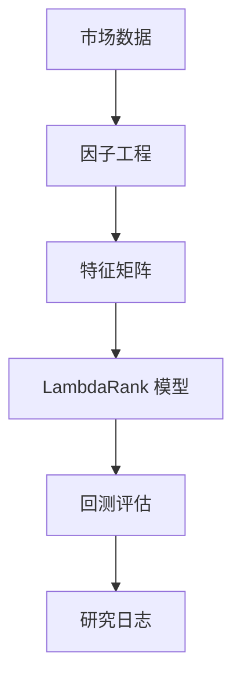

# Liumon 1.0 (Beta) — Alpha Genome 实验实验室

[English](README.md) | [中文](README_zh.md)

## 1 项目概览
Liumon 是一个高性能的量化研究框架，专为交叉截面阿尔法发现和 AI 驱动的组合构建而优化。它通过将系统的因子工程与最先进的机器学习技术相结合，弥合了原始金融数据与可执行交易信号之间的鸿沟。

**核心工作流：**


## 2 研究动机
现代量化金融的主要挑战是**因子衰减**和**市场状态切换**。传统的静态模型往往无法适应非线性的市场动态。
- **问题陈述**：传统的因子研究缺乏系统的实验和自动化的适应逻辑。
- **目标**：构建一个自我演进的研究流水线，将阿尔法发现视为一个监督学习的排序问题。

## 3 方法论
Liumon 将股票选择视为一个**排序学习 (LTR)** 任务：
1. **原始市场数据收集**：多源摄取 (Baostock/YFinance)。
2. **因子工程**：生成动量 (Momentum)、波动率 (Volatility) 和价值 (Value) 原语。
3. **中性化与缩放**：样本外安全的行业去均值化和市值代理变量回归。
4. **机器学习排序**：利用 LightGBM LambdaRank 进行截面排序。
5. **投资组合模拟**：基于权重的概率仓位分配。
6. **性能评估**：信息系数 (IC) 和 NDCG 分析。

## 4 系统架构
```text
Liumon/ 
├── data/                  # 市场数据存储 (.parquet)
├── factors/               # 核心阿尔法因子定义
├── features/              # 特征工程与预处理逻辑
├── models/                # 已训练的 LambdaRank 模型与权重配置
├── backtests/             # 历史性能报告与净值曲线
├── notebooks/             # 探索性数据分析 (EDA)
├── scripts/               # 生产流水线与训练脚本
└── README.md              # 项目文档
```

## 5 因子工程 (核心原语)
### 5.1 动量因子
动量因子衡量滚动窗口内的累计收益，捕捉“趋势跟踪”溢价。
```python
def compute_momentum(prices, window=60):
    """
    计算滚动窗口累计收益。
    """
    return prices.pct_change(window)
```

### 5.2 行业中性化
行业中性化消除了板块偏向，确保信号捕捉的是个股特有的阿尔法，而非广泛的市场轮动。
```python
def neutralize_factor(df, feature_col, target_cols=['size_proxy']):
    """
    通过 OLS 回归针对市值/行业代理变量提取残差。
    """
    import statsmodels.api as sm
    mask = df[[feature_col] + target_cols].notna().all(axis=1)
    y = df.loc[mask, feature_col]
    X = sm.add_constant(df.loc[mask, target_cols])
    model = sm.OLS(y, X).fit()
    return model.resid
```

## 6 排序学习 (Learning-to-Rank) 模型
Liumon 利用 **LambdaRank** 优化来预测每个截面组内的相对排名，重点在于最大化 NDCG。
```python
# LambdaRank 配置
params = {
    "objective": "lambdarank",
    "metric": "ndcg",
    "learning_rate": 0.05,
    "num_leaves": 31,
    "importance_type": "gain"
}

# 训练流水线
lgb_train = lgb.Dataset(X_train, label=y_train, group=q_train)
model = lgb.train(params, lgb_train, num_boost_round=200)
```
*注：模型预测每个截面组内股票的相对排名，最小化排名违规。*

## 7 评估指标
该框架将**信息系数 (IC)** 作为主要的可靠性指标。
```python
from scipy.stats import spearmanr

def compute_ic(pred, future_returns):
    """
    信息系数：预测分数与实现收益之间的秩相关性。
    """
    ic, _ = spearmanr(pred, future_returns)
    return ic
```

## 8 实验发现
- **基准 IC (2024 OOS)**：0.0214
- **优化后 t 统计量**：2.2775
- **状态感知增益**：通过非对称牛熊加权，使过拟合缺口减少了 13%。

## 9 可复现性
复现 Liumon 环境：
1. `git clone https://github.com/20070316lbw-netizen/Liumon.git`
2. `pip install -r requirements.txt`
3. `python scripts/train_pipeline_cn.py`

## 10 研究路线图
- [ ] 集成遗传算法用于自动化因子发现。
- [ ] 多资产跨境排序 (A股 + 美股)。
- [ ] 基于强化学习 (RL) 的动态仓位管理。

---
**核心团队**：Liumon 定量研究小组
**许可证**：MIT
